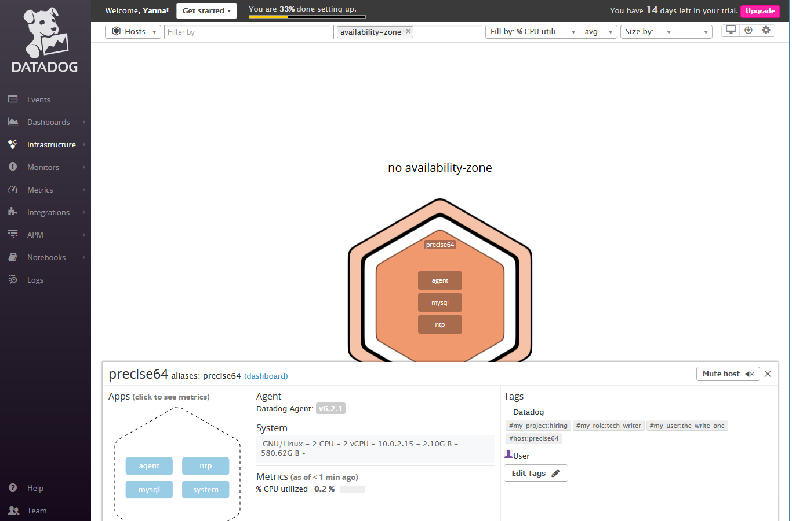
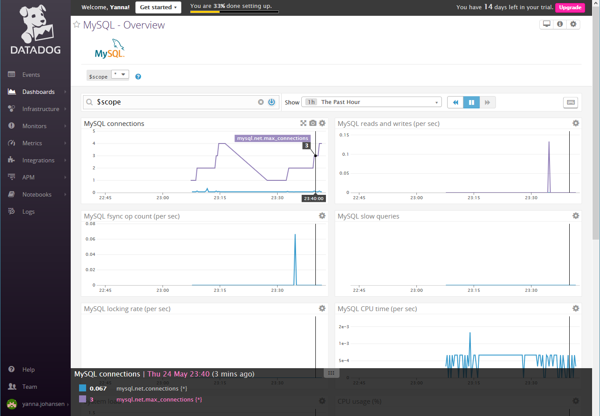
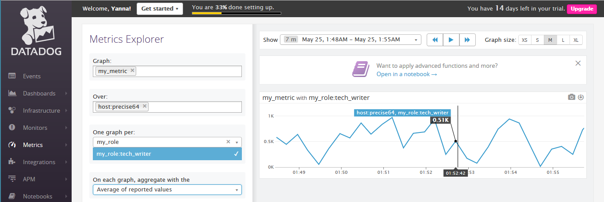
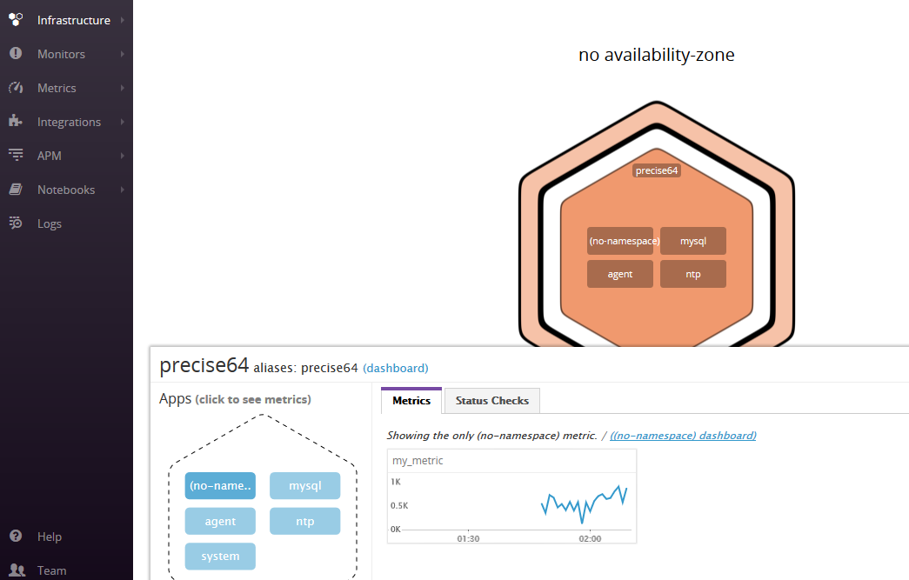
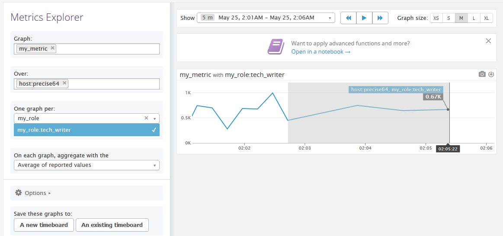
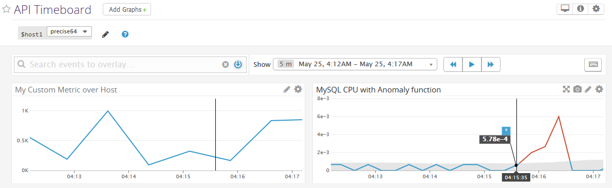
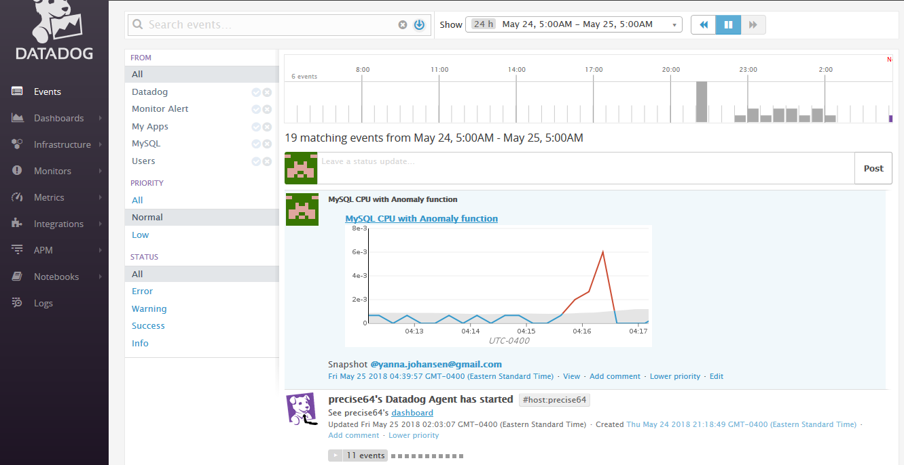

Here are the steps for the Quick Start Guide for the Datadog product. 
The detailed, easy-to-follow documentation found on the Datadog website, 
combined with prior experience in related areas, were essential to 
completing the varied tasks presented in this guide.

## Prerequisites - Setting up the environment

The local machine used in this excercise is Windows 10 64-bit.

1. Installing Vagrant

The virtual environment manager Vagrant is installed following instructions for setting up 
[Vagrant with Ubuntu 12.04 VM](https://github.com/jeremy-lq/hiring-engineers/blob/tech-writer/README.md#vagrant).

Note: This particular Linux version, being LTS (long term support),
has proven somewhat outdated for the purposes of installing
other products and libraries (See [troubleshooting](blog/blog.md#troubleshooting) in our blog entry). 
So rather than changing course, a workaround can be used. 
(For a stable and long-term testing environment, a later version of the Linux setup can be used.)

The folder where Vagrant is installed is `C:\VM\Vagrant`

2. Intalling VirtualBox

The VM manager software VirtualBox is installed
following instructions at [Download VirtualBox](https://www.virtualbox.org/wiki/Downloads).

3. Rebooting the host machine is required to apply changes from previous installations.

4. Spinning-up default VM

First, we create an instance of our VM using the Vagrant template `hashicorp/precise64`, which is Ubuntu 64 12.X LTS.
```
    > md c:\VM\test
    > cd c:\VM\test
    > vagrant init 
```

You can view allocated resources in the VirtualBox Manager.
In order to prevent performance and related issues during our testing,
the memory is increased in `c:\VM\test\Vagrantfile`:
```
      config.vm.provider "virtualbox" do |vb|
        vb.memory = "2048"   # Mb was "398"
      end
```

Next we can start the VM, and connect to it using SSH (the secure shell)
```
    > vagrant up

    > vargant ssh
```

Note: The default username `vagrant / vagrant` is used by SSH session.
The password is not requested, since the authentication is performed
using the locally stored encrypted key.

5. Update the Linux environment

Lastly, we need to update the command-line installation management tools
for the Linux environment. To make sure we can download the necessary tools,
we also need to install `curl`.
```
    $ sudo apt-get update
    $ sudo apt-get install curl
```

### Installing Datadog

We follow the instructions for installing the Datagod Agent on Ubuntu environment
at [Installing on Ubuntu](https://app.datadoghq.com/account/settings#agent/ubuntu):
```
    $ export DD_API_KEY=baa4d41e9cbdd3ffc335a6acc3476071 
    $ bash -c "$(curl -L https://raw.githubusercontent.com/Datadog/datadog-agent/master/cmd/agent/install_script.sh)"
```

Upon successful installation, we note the console output:
```
    ...
        * Adding your API key to the Agent configuration: /etc/datadog-agent/datadog.yaml

        * Starting the Agent...

        datadog-agent start/running, process 2262

        Your Agent is running and functioning properly. It will continue to run in the
        background and submit metrics to Datadog.

        If you ever want to stop the Agent, run:

            sudo stop datadog-agent

        And to run it again run:

            sudo start datadog-agent
```

The after stopping the agent, we verify a successful start again:
```
    $ sudo start datadog-agent
    datadog-agent start/running, process 3023

    $ pstree -a | less
      ...
      |-agent start -p /opt/datadog-agent/run/agent.pid
      |   `-9*[{agent}]
      |-trace-agent --config /etc/datadog-agent/datadog.yaml --pid /opt/datadog-agent/run/trace-agent.pid
      |   `-6*[{trace-agent}]

    $ ps axu | less
    dd-agent  3023  0.7  9.8 688732 36812 ?        Ssl  01:27   0:01 
        /opt/datadog-agent/bin/agent/agent start -p /opt/datadog-agent/run/agent.pid
    dd-agent  3025  0.0  1.7 340704  6480 ?        Ssl  01:27   0:00 
        /opt/datadog-agent/embedded/bin/trace-agent --config /etc/datadog-agent/datadog.yaml --pid /opt/datadog-agent/run/trace-agent.pid
```

We also note the location of the logs, in case there are errors and for future reference:
```
    /var/log/datadog/agent.log
```

### Restarting the Agent

Restarting is necessary when editing the main configuration file and that of the Agent:

 * `/etc/datadog-agent/datadog.yaml`
 * `/etc/datadog-agent/conf.d/mysql.d/conf.yaml`
 * etc

To perform a restart:
```
    $ sudo service datadog-agent restart
        ... process 16581
```

For more details, see [Agent commands](https://docs.datadoghq.com/agent/faq/agent-commands/).

## Collecting Metrics

Reference locations:

 - Log file: `~/ddagent-install.log`
 - Config file: `/etc/datadog-agent/datadog.yaml`


### Show Custom Tags on the Host Map page

1. We add the tags in the Agent config file 

The configuration file to edit:
```
    $ sudo vi /etc/datadog-agent/datadog.yaml
```
We provide the `tags` section:
```
    tags:
      - my_user:the_write_one
      - my_project:hiring
      - my_role:tech_writer
```

2. Next, we restart the Agent (see [above](#restart-agent))

3. And we show the Host and its tags on the [Host Map](https://app.datadoghq.com/infrastructure/map) page in Datadog



### Install a Datadog integration with a local database

1. Installing MySQL
```
    $ sudo apt-get update
    $ sudo apt-get install mysql-server
        root user: no passowrd
```
Note: `mysql_secure_installation` is not executed within the scope of this procedure.

2. Creating a sample MySQL database

We use instructions under [Connecting to the MySQL Server with the mysql Client](https://dev.mysql.com/doc/mysql-getting-started/en/#mysql-getting-started-connecting).

The following commands are used to establish a sample instance and execute typical session:
```
    $ mysql -u root
    > create database pets;
    > show databases;
    > use pets
    > CREATE TABLE cats ...
    > show tables;
    > DESCRIBE cats;
    > INSERT INTO cats ...
    > SELECT * FROM cats;
    > SELECT * FROM cats WHERE name LIKE '%ie';
    > SHOW CREATE TABLE cats\G
```

3. Installing Datadog Agent in MySQL

We use instructions under [MySQL integration](https://app.datadoghq.com/account/settings#integrations/mysql).

We configure the Agent to connect to MySQL
```
    $ sudo cp /etc/datadog-agent/conf.d/mysql.d/conf.yaml.example /etc/datadog-agent/conf.d/mysql.d/conf.yaml
    $ sudo vi /etc/datadog-agent/conf.d/mysql.d/conf.yaml
```
conf.yaml:
```
        init_config:

        instances:
          - server: localhost
            user: datadog
            pass: dqKvIf[Hua18lWKZo2qHdQ9F
            tags:                  # Optional
              - optional_tag1
              - optional_tag2
            options:               # Optional
              replication: false
              galera_cluster: 1
```

Next, we restart Agent (see [above](#restart-agent))

4. Executing sample MySQL sessions

We can make more connections from the Linux shell using:
```
    $ mysql -u root
```

Then we execute a sample session to generate metrics:
```
show databases;
use pets;
show tables;
select * from cats;
```

5. Showing database metrics in [MySQL - Overview](https://app.datadoghq.com/dash/integration/12/mysql---overview?live=false&page=0&is_auto=false&from_ts=1527209956399&to_ts=1527242282882&tile_size=m) dashboard:



### Custom Agent "check" that submits a specifc random metric

1. We create Python code for the Agent "check"

`/etc/datadog-agent/checks.d/my_check.py`:
```
        from checks import AgentCheck

        from random import randint

        class MyCheck(AgentCheck):
            def check(self, instance):
                self.gauge('my_metric', randint(0, 1000))
```
2. We create a "check" configuration file:

`/etc/datadog-agent/conf.d/my_check.yaml`:
```
        init_config:

        instances:
            [{}]
```

3. We restart the Agent (see [above](#restart-agent))

4. Then we verify the custom "check":
```
    $ sudo datadog-agent check my_check

        === Series ===
        {
          "series": [
            {
              "metric": "my_metric",
              "points": [
                [
                  1527227580,
                  647
                ]
              ],
              "tags": null,
              "host": "precise64",
              "type": "gauge",
              "interval": 0,
              "source_type_name": "System"
            }
          ]
        }
        =========
        Collector
        =========

          Running Checks
          ==============
            my_check
            --------
              Total Runs: 1
              Metrics: 1, Total Metrics: 1
              Events: 0, Total Events: 0
              Service Checks: 0, Total Service Checks: 0
              Average Execution Time : 0ms
```

The resulting metric is available in [Metrics Explorer](https://app.datadoghq.com/metric/explorer?live=false&page=0&is_auto=false&from_ts=1527807531464&to_ts=1528059031473&tile_size=m&exp_metric=my_metric&exp_scope=&exp_agg=avg&exp_row_type=metric)



and in the Hosts view:




5. We change our "check"'s collection interval so that it only submits the metric once every 45 seconds.

**Bonus Feature:** Change the collection interval without modifying the Python "check" file you created?

`/etc/datadog-agent/conf.d/my_check.yaml`:
```
        init_config:

        instances:
            - min_collection_interval: 45
```

6. Next, we restart the Agent (see [above](#restart-agent))

7. Here we show the Dashboard with the time changed from 15 seconds to 45 seconds.



## Visualizing Data

### Utilize the Datadog API to create a Timeboard

We get the API_KEY and APP_KEY using [Integrations / API Keys](https://app.datadoghq.com/account/settings#api)

1. We install the Datadog API on local machine:
```
    > pip install datadog
```

2. We create a Python shell script:

   View: [create_timeboard.py](create_timeboard.py)

3. We capture a snapshot in the [API Timeboard](https://app.datadoghq.com/dash/820500/api-timeboard?live=false&page=0&is_auto=false&from_ts=1527236026000&to_ts=1527236427416&tile_size=m) Dashboard:



The snapshot is captured in the Dashboard tile using the "camera" icon.
The target user is indicated with `@` notation, which promts with available email address.

The resulting snapshot can be found in the [Events](https://app.datadoghq.com/event/stream) UI:



**Bonus Feature:** What is the Anomaly graph displaying?

Anomaly function applied to timeseries graph displays a additional shaded area,
which represents "normal" range of behavior over a certain near past period of time.

The specific normal behavior depends on the selected mode. For example, in our case
it is "Basic", which tracks simple rolling quantile range (e.g. 5% - 95%).

It does not take into account non-linear shifts or periodic seasonal trends.
The Bounds parameter determines how narrow (small values near 1) or wide (values near 6)
the normal area is; the wider the area, the fewer anomalies it will determine.
